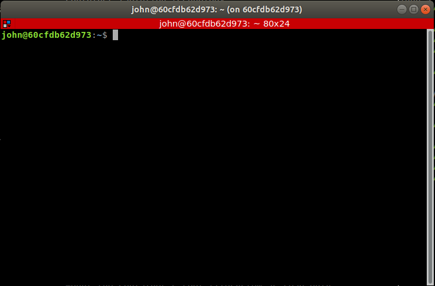

# cs422_docker
Docker container for cs422 Introduction to Robotics

This repo contains a docker container for use in cs422 Introduction to Robotics module. The repo is being made available as a convenience for students that have a familiarity with docker and who would rather use docker than the virtualbox image.

## Requirements and Setup
To install and run the container you will need to be running Linux and will first need to install **docker communinty edition**. This will vary based on your particular operating system so you will need to find a suitable walk-through. 

Here are a few for more common variants of Ubuntu:
* [https://www.digitalocean.com/community/tutorials/how-to-install-and-use-docker-on-ubuntu-18-04](Ubuntu 18.04)
* [https://www.digitalocean.com/community/tutorials/how-to-install-and-use-docker-on-ubuntu-20-04](Ubuntu 20.04)

## Building the container
To build the container use the `build` script from the `cs422_docker` folder:
```john@laptop:~/cs422_docker$ ./build```

## Running the container
When executed, the container will result in a bash shell running inside the container inside a terminator window. Exiting the terminator window will terminated the container. 



In order to support a persistent file storage (i.e. to store your ROS workspace files) the `run` script expects a `cs422_ws` folder in your home folder. When run, this folder is mounted in your home folder within the container (i.e. `/home/<username>/cs422_ws`). This folder will be created automatically if it does not exist on the first run.

To run the container use the `run` script
```john@laptop:~/cs422_docker$ ./run```

## Development workflow
All ROS related commands, such as `catkin_make`,`rosrun ...`, `roslaunch ...`, etc. should be run **inside the container** (i.e. in the `terminator` window), whereas you should develop your code (i.e. run your IDE or text-editor) **on your host machine**.

The typical workflow is:
1. Edit your code on your host machine using your favourite text editor or IDE
2. Spin up the container
   * `cd ~/cs422_docker`
   * `./run`
3. In the container window run whichever ROS commands you wish 
4. Iterate steps 1. & 3.


